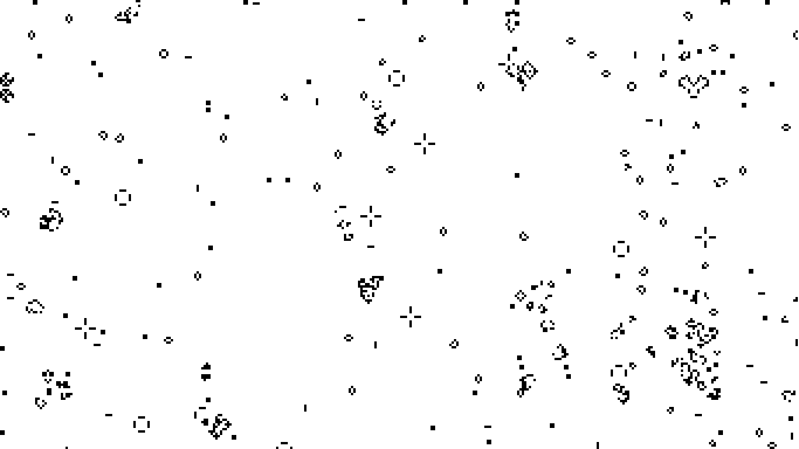
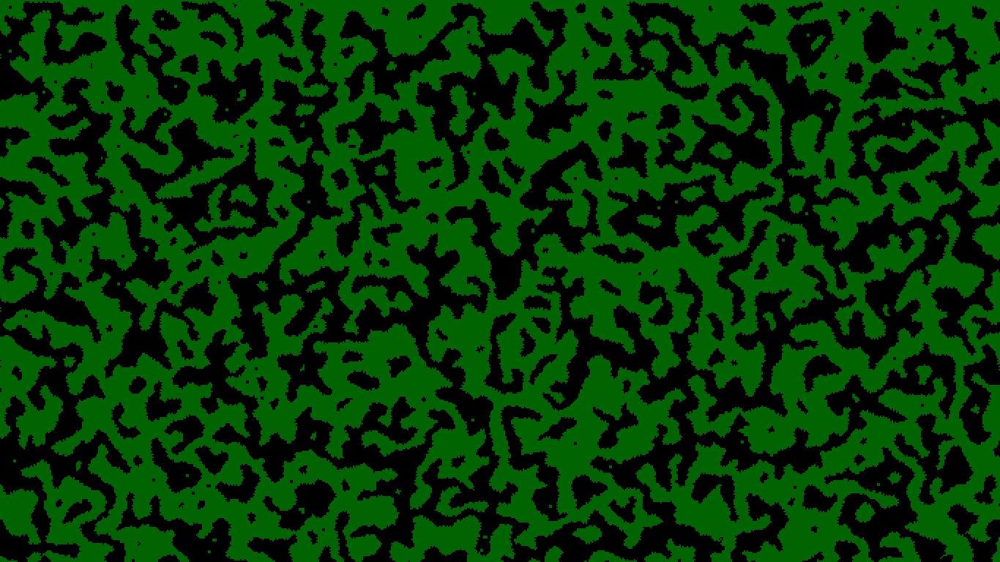
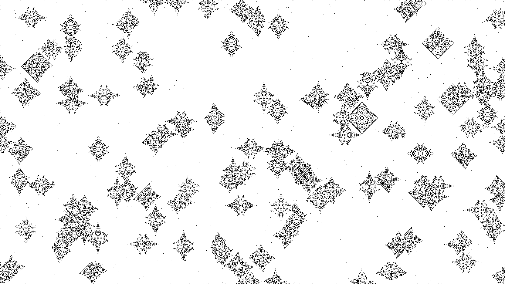
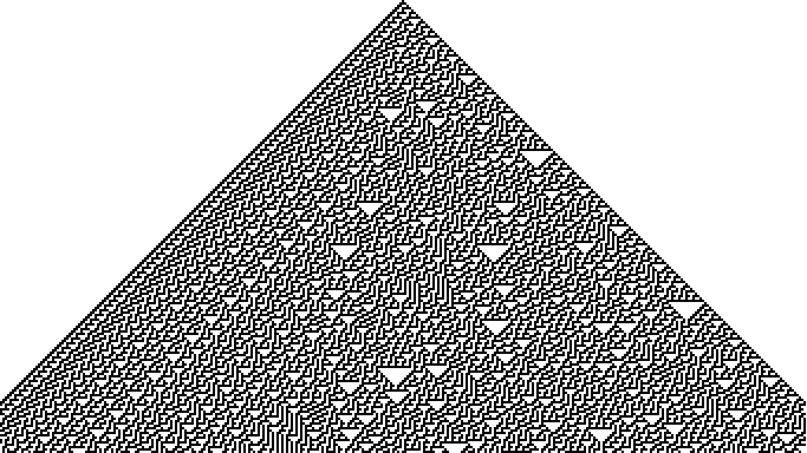
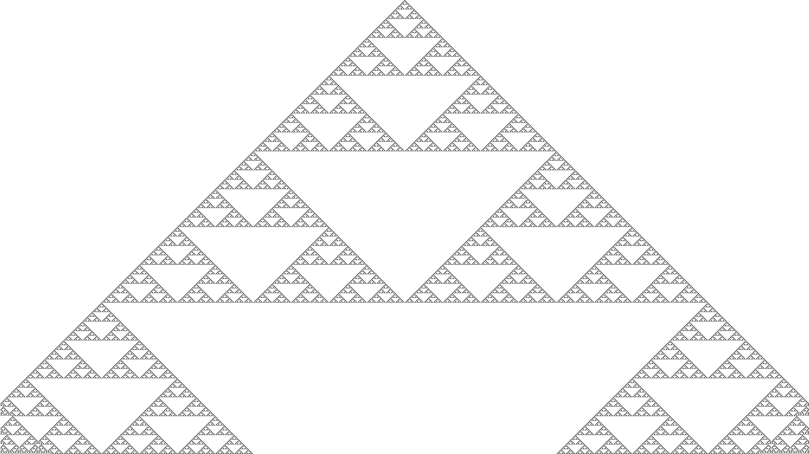

#CAgen

CAgen draws elementary and life-like cellular automata on a display. This program is intended to be a screensaver on GNU/Linux.

##Build
Compile with `gcc -o cagen lifeca.c elemca.c cagen.c -lm -lSDL`

##Usage
```
cagen [OPTIONS]`

OPTIONS
-l <Bx/Sy rule>   generate 2D life-like CA
-d <density>      generation 0 population density (floating-point value w/ range (0,1))

-e <Wolfram code> generate 1D elementary CA		
-r                generation 0 random configuration

-s <N times>      scale N times
-f <r,g,b>        foreground color in decimal RGB values
-b <r,g,b>        background color in decimal RGB values
```

CAgen defaults to a monochrome Conway's Life game (B3/S23) with 0.25 population density scaled 4x. Press any key to exit. Click the mouse to take a screenshot. The screenshot will be saved as a bitmap the file `screenshot.bmp`.

###B3/S23 (Life)

###B4678/S35678 (Anneal) with camo color

###B24/S0

###Rule 30

###Rule 30 randomized (attempt to make it look like Conus textile)

###Rule 90 (Sierpiński Triange)

